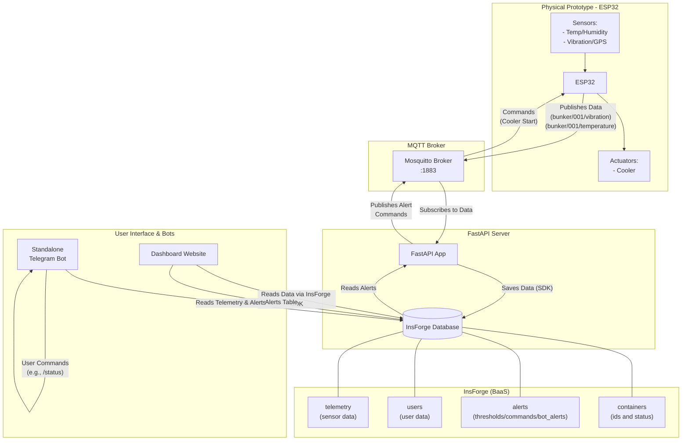

# Smart Shipping Container - System Architecture

This document outlines the software architecture for the IoT Smart Shipping Container project.

## 🏗️ System Architecture



## ☁️ Google Cloud Deployment Strategy

To run this reliably in production, the system will be deployed to Google Cloud Platform (GCP).

*   **Google Compute Engine (VM)**: A single VM (e.g., `e2-small`) running Docker Compose. This is the recommended approach because the Mosquitto MQTT broker requires raw TCP connections on port 1883, which is difficult to manage on serverless platforms like Cloud Run.
*   **Containers on the VM**:
    *   **Mosquitto Broker**: Exposes port 1883 to the public internet for the ESP32 to connect.
    *   **FastAPI Backend**: Runs alongside the broker, communicating via the internal Docker network.
*   **Frontend Hosting**: The Next.js dashboard can be hosted on Vercel (recommended for Next.js) or GCP Cloud Run for serverless scaling.
*   **Database**: Managed completely by InsForge (BaaS).

## 📦 Data Flow & Components

### 1. The Edge (ESP32)
The physical hardware. It reads from sensors and packages the data into a JSON payload on two separate MQTT channels.
*Vibration/GPS Payload (`bunker/001/vibration`):*
```json
{
  "lat": 41.40520817,
  "lng": 69.316828,
  "speed": 0.07408,
  "timestamp": "16/05/2026 08:54:07",
  "unit": "g",
  "vib_avg": 0.369982642,
  "vib_peak": 3.227422677
}
```

*Temperature Payload (`bunker/001/temperature`):*
```json
{
  "hum": 39.4,
  "temp": 25.8,
  "timestamp": "16/05/2026 08:54:19"
}
```

### 2. The Broker (Mosquitto)
The central nervous system. It receives messages from the ESP32 on the two channels and broadcasts them to the FastAPI backend. It also transmits action commands (like starting the cooler) from the backend back to the ESP32.

### 3. The Backend (FastAPI)
The brains of the backend software.
*   **Ingestion**: Constantly listens to the Mosquitto MQTT broker for new data on `bunker/+/vibration` and `bunker/+/temperature`.
*   **Storage**: Saves the incoming JSON data to the `telemetry` table in the InsForge database.
*   **Alert Processing**: Reads from the `alerts` table in InsForge to check if any actions need to be sent to the broker (e.g., frontend sent an alert to start the cooler at a certain temperature).
*   **Command Publishing**: Publishes commands to the MQTT broker based on active alerts.

### 4. Database (InsForge)
A robust PostgreSQL-based Backend-as-a-Service containing 4 main tables:
*   **`telemetry`**: Stores all raw data coming from the FastAPI broker subscriber.
*   **`users`**: Stores user account data, time joined, etc.
*   **`alerts`**: Stores actions/alerts sent by the frontend (e.g., cooler activation thresholds). FastAPI reads this to trigger the physical cooler.
*   **`containers`**: Stores container IDs, metadata, and current status.

### 5. The Frontend Dashboard
The user interface.
*   Takes data directly from the InsForge DB using the InsForge SDK (no need to hit FastAPI for historical/current data).
*   Sends alerts/commands directly to the `alerts` table in the database, which FastAPI then processes to activate hardware.
